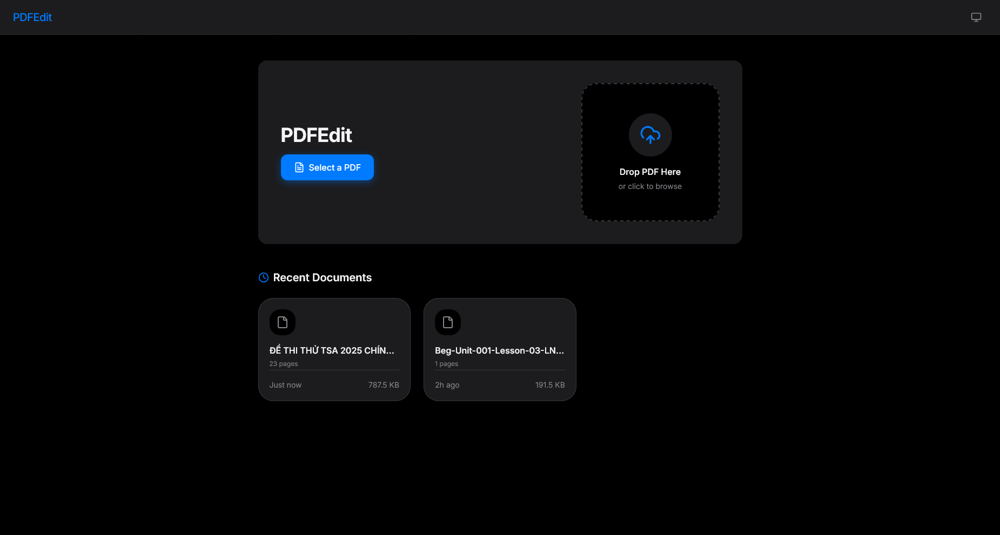
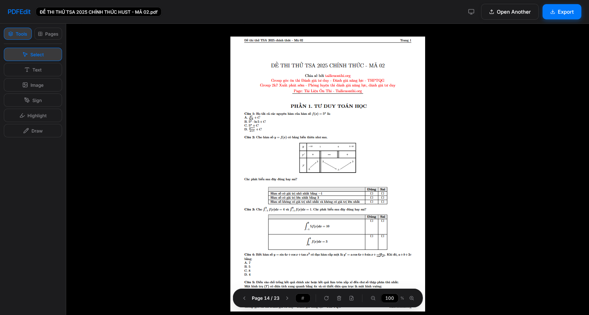

# PDFEdit
A PDF Editor with all features that one needs, all integrated into a single modern interface




Have you ever want a reliable PDF Editor that run locally, meets all your needs, and free of charge?

PDFEdit aim to replace messy PDF tools that just have too many features, but are separete from one another, all while being free of charge with an UI that resembles Acrobat.

<br/>

***NOTE: This project is entirely vibe-coded with Claude Sonnet and is still a Work In Progress***

> **WIP:** Currently, there are some bugs with the export function related to annotations, which is currently handled in `lib/pdf/PdfEngine.ts` and there is not yet the ability to undo-redo, edit text, edit annotations after export. Contributions are welcome!


## Getting Started

### Prerequisites
- [Node.js](https://nodejs.org/) (v18 or higher)
- npm or yarn

### Installation
1. Clone the repository:
   ```bash
   git clone https://github.com/LanLP0/PDFEdit.git
   ```
2. Install dependencies:
   ```bash
   cd PDFEdit
   npm install
   ```
3. Start the application:
   ```bash
   npm run dev
   ```


## Contributing

Contributions are what make the open source community such an amazing place to learn, inspire, and create. Any contributions you make are greatly appreciated.

1. Fork the Project
2. Create your Feature Branch (`git checkout -b feature/AmazingFeature`)
3. Commit your Changes (`git commit -m 'Add some AmazingFeature'`)
4. Push to the Branch (`git push origin feature/AmazingFeature`)
5. Open a Pull Request

## License

Distributed under the GNU GPLv3 License. See `LICENSE` for more information.
