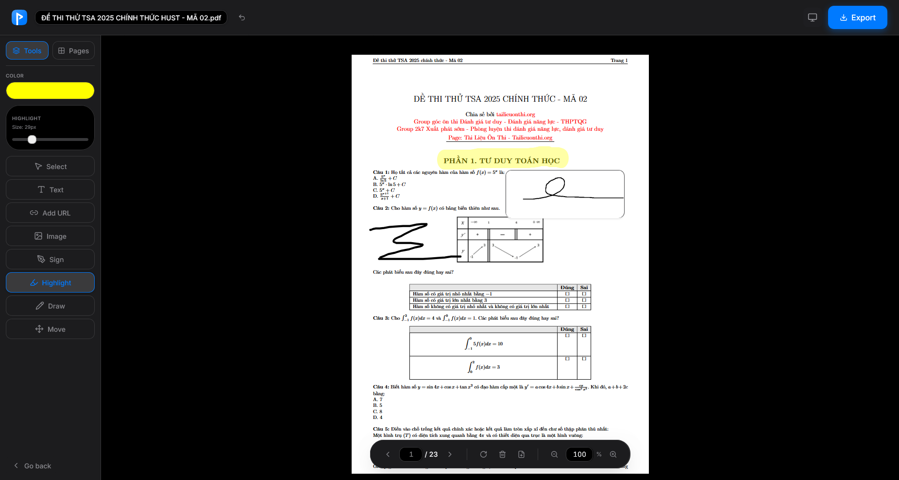
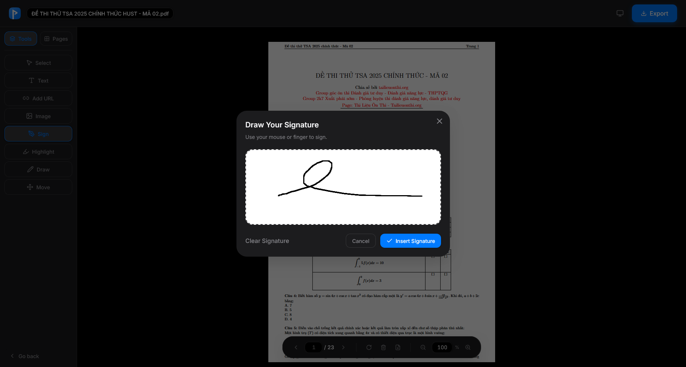
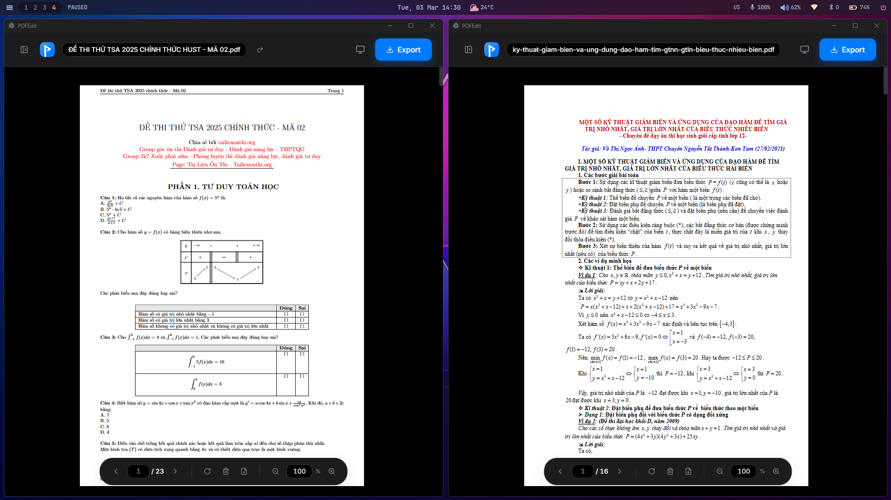
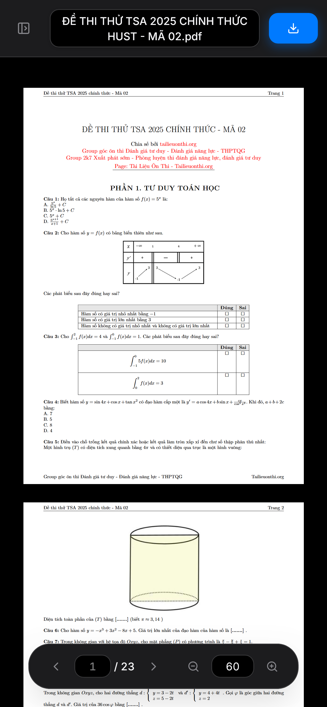
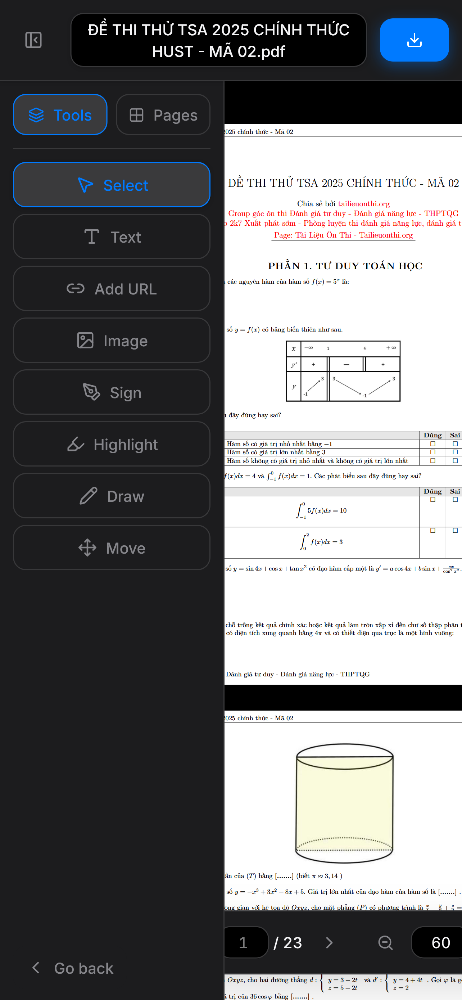

# PDFEdit

<p align="center">
  
</p>

<p align="center" style="display: flex; justify-content: center; align-items: center;">
  
  &nbsp;&nbsp;
  
  &nbsp;&nbsp;
  <a href="https://lanlp0.github.io/PDFEdit">
    
  </a>
</p>

<br/>

A PDF Editor with all features that one needs, all integrated into a single modern interface


Have you ever want a reliable PDF Editor that run locally, meets all your needs, and free of charge?

PDFEdit aim to replace messy PDF tools that just have too many features, but are separete from one another, all while being free of charge with an UI that resembles Acrobat.

More images can be found in [Showcases](#showcases).

<br/>

## Features

- **Cross-Platform:** Run on Browser, Windows, macOS, Linux, and Mobile too!
- **Integrated UI:** Never have to fish through menus to find the tools you need
- **Modify PDF:** Merge, Reorder, Rotate, Delete Pages
- **Various PDF Tools:** Add Text-Image-Link, Add Signature, Highlight, Draw

## Installation

Currently, there are no straight forward installation files for this application.  
<br/>
You can run PDFEdit directly on the web at [https://lanlp0.github.io/PDFEdit](https://lanlp0.github.io/PDFEdit).

Or install it from [https://github.com/LanLP0/PDFEdit/actions/workflows/build_electron_app.yml](https://github.com/LanLP0/PDFEdit/actions/workflows/build_electron_app.yml)

- Choose the latest workflow run (the one on top)
- Click one file from `Artifacts` section depending on your OS to download the app

| OS      | Artifact                         | File                       | Install                                                   |
| ------- | -------------------------------- | -------------------------- | --------------------------------------------------------- |
| MacOS   | `build-artifacts-macos-latest`   | `pdfedit-darwin-arm64.zip` | Extract the zip file, find the application and install it |
| Windows | `build-artifacts-windows-latest` | `pdfedit-win32-x64.zip`    | Extract the zip file, find the application and install it |
| Linux   | `build-artifacts-linux-latest`   | `pdfedit-linux-x64.zip`    | Extract the zip file, find the application and install it |

- Congratulations, you can now use **PDFEdit**!

## Getting Started (For Developer)

### Prerequisites

- [Node.js](https://nodejs.org/) (v18 or higher)
- npm

### Installation

1. Clone the repository:
   ```bash
   git clone https://github.com/LanLP0/PDFEdit.git
   ```
2. Install dependencies:
   ```bash
   cd PDFEdit
   npm install
   ```
3. Start the application:
   ```bash
   npm run dev
   ```
4. Build electron app:
   ```bash
   npm run make
   ```

## Contributing

Contributions are what make the open source community such an amazing place to learn, inspire, and create. Any contributions you make are greatly appreciated.

1. Fork the Project
2. Create your Feature Branch (`git checkout -b feature/AmazingFeature`)
3. Commit your Changes (`git commit -m 'Add some AmazingFeature'`)
4. Push to the Branch (`git push origin feature/AmazingFeature`)
5. Open a Pull Request

## License

Distributed under the `GNU GPLv3` License. See [LICENSE](./LICENSE) for more information.

## Showcases

### Homepage


### Editpage


### Annotations



### Signature



### Desktop



### Mobile (Browser)



